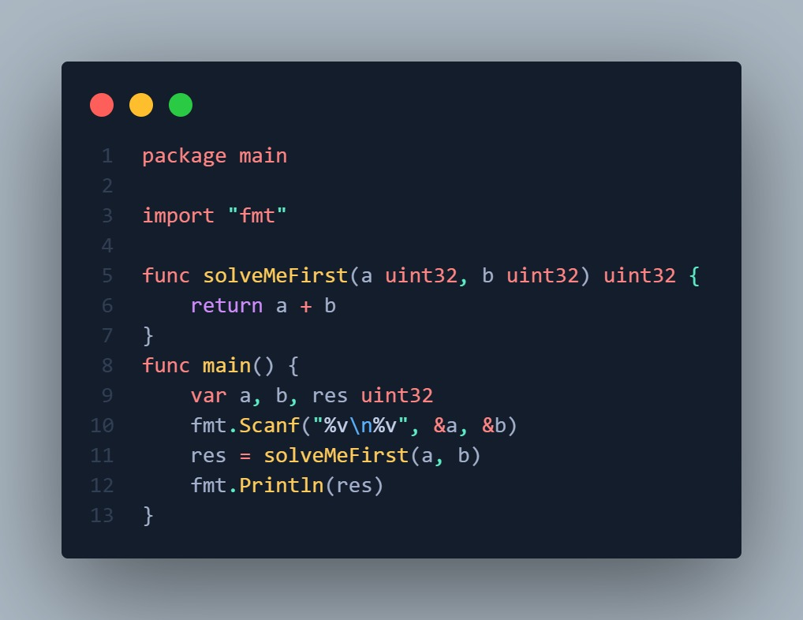
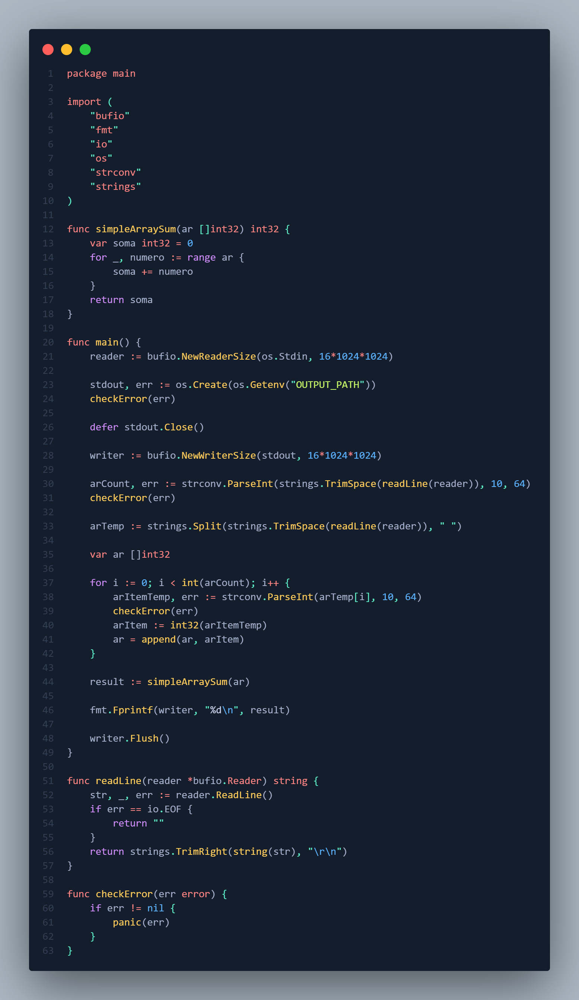
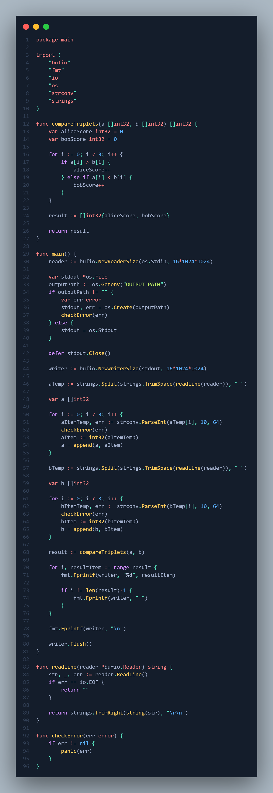
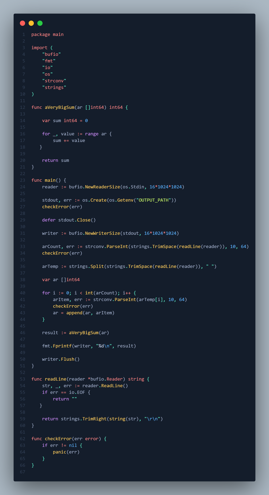
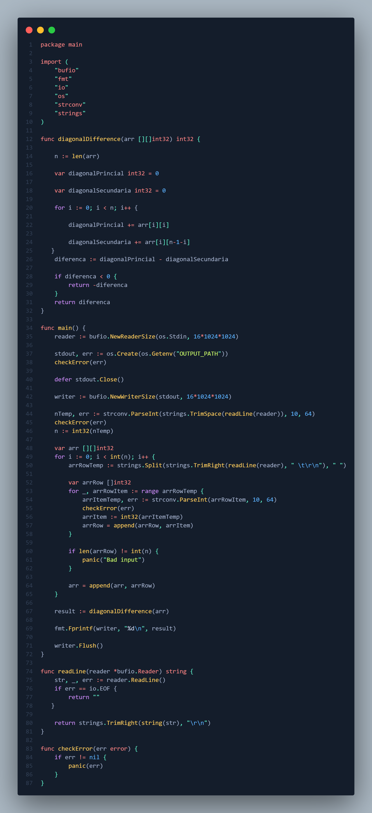
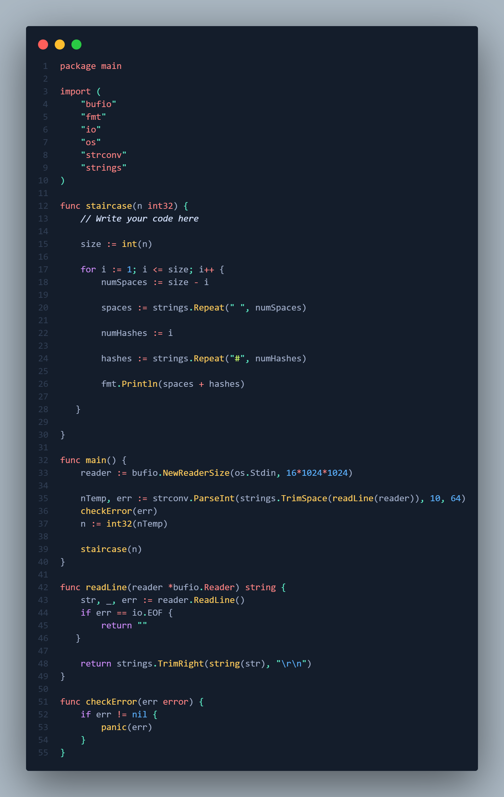

# Registro de Progresso - 100 Dias de HackerRank com Go

## Dias Concluídos: 1/100

- [x] **Dia 01:** [função-soma](days/day01-função-soma/) - _Resolvido em 15/08/2025_
* Screenshot da resolução:
* 
- [x] **Dia 02:**[simpleArraySum](days/day02-simpleArraySum/) - _Resolvido em 16/08/2025_
* Screenshot da resolução:
* 
- [x] **Dia 03:** [comparetheTriplets](days/day03-compareTheTriplets/) - _Resolvido em 17/08/2025_
* Screenshot da resolução:
* 
- [x] **Dia 04:** [AVeryBigSum](./days/day04-day04-AVeryBigSum/) - _Resolvido em 18/08/2025_
* Screenshot da resolução:
* 
- [x] **Dia 05:** [diagonalDifference](days/day05-DiagonalDifference/) - _Resolvido em 19/08/2025_
* Screenshot da resolução:
* 
- [x] **Dia 06:** [Staircase](./days/day06-staircase/) - _Resolvido em 20/08/2025_
* Screenshot da resolução:
* 
- [x] **Dia 07:** [PlusMinus](days/day07-PlusMinus/) - _Resolvido em 21/08/2025_
* Screenshot da resolução:
* 
- [ ] **Dia 08:**
- [ ] **Dia 09:**
- [ ] **Dia 10:**
- [ ] **Dia 11:**
- [ ] **Dia 12:**
- [ ] **Dia 13:**
- [ ] **Dia 14:**
- [ ] **Dia 15:**
- [ ] **Dia 16:**
- [ ] **Dia 17:**
- [ ] **Dia 18:**
